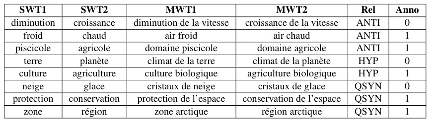

# List-of-semantically-linked-MWTs

This is the repository of a dataset used for semantic relation acquisition between multiword terms (MWTs) or analogy tests. The necessary resources for constructing the dataset are also uploaded in this Github, except for the corpus, which is not allowed to be made public.

- [Context](#context)
- [Motivation](#motivation)
- [Approach](#approach)
- [Resources used for generating the dataset](#resources-used-for-generating-the-dataset)
  * [Corpus](#corpus)
  * [Reference for semantic relations ("RefProj.csv")](#reference-for-semantic-relations---refprojcsv--)
- [Different steps for generating the dataset](#different-steps-for-generating-the-dataset)
- [Statistics and a sample of the dataset](#statistics-and-a-sample-of-the-dataset)

## Context

The dataset is constructed as part of the Addicte project (Distributional analysis in specialized domain, ANR-17-CE23-0001), funded by the French National Research Agency (ANR). The dataset has been introduced in the paper "[A study of semantic projection from single-word terms to multi-word terms in the environment domain](https://www.aclweb.org/anthology/2020.computerm-1.7/)", accepted by COMPUTERM 2020.

## Motivation

Current research on identifying relations between terms mainly focuses on SWTs. However, MWTs and their semantically related terms are also in demand in many applications such as text simplification and machine translation, but only a few works concentrate on them. Therefore, we want to work on the semantic relation acquisition between MWTs, and a list of semantically linked MWTs is then in demand for the study. Since such a dataset does not yet exist in the domain that interests us (the environmental field), our work's first step is to construct this dataset. 

## Approach

The dataset is generated by the semantic projection method.
The semantic projection, also known as semantic variant and often referred to as a compositional method, is widely used to generate MWTs and predict relations between them from semantically related SWTs. This method is based on the assumption that MWT meaning is compositional. One consequence of this hypothesis is that when two MWTs t1 and t2 only differ by one of their components c1 and c2, the semantic relation between c1 and c2 is identical to the one between t1 and t2 because c1 and c2 contribute in the same way to the meanings of the MWTs. For instance, the relation between the *croissance de la population* and *diminution de la population* is the same as the one between *croissance* and *diminution*. Our hypothesis is actually a bit stronger because we consider that the equivalence holds even when t1 and t2 do not have the same (syntactic) structure. 

## Resources used for generating the dataset

### Corpus

The corpus used for extracting MWT candidates is a specialized monolingual French corpus in the environment domain (ELRA-W0065) created in the framework of the [PANACEA project](http://panacea-lr.eu/en/info-for-researchers/data-sets/monolingual-corpora). The corpus contains 35453 documents (about 50 million words) with different levels of specialization. The corpus has been preprocessed: extraction of the text, normalization of the characters, lemmatization with TreeTagger. 

### Reference for semantic relations ("RefProj.csv")

To build the dataset by the semantic projection, we need a list of simple terms (SWT) connected by the semantic relation as a reference. We extracted 831 pairs of simple terms (nouns and adjectives) from the list proposed by [Colborne and Drouin](https://github.com/gbcolborne/TALN_2016) ("refCD.csv").
Three types of relations are contained in the "RefPro" :
* ANTI: the opposite relation and the contrastive relation ;
* QSYN: hyponyms and hypernyms ;
* HYP: synonyms, quasi-synonyms ans cohyponyms.

## Different steps for generating the dataset ("data.csv")

1. Extract all the MWT candidates which contain two content words by [TermSuite](http://termsuite.github.io);
2. Form the MWTs pairs that share a common word and where the two other words are a pair of SWTs connected in "RefCD.csv";
3. Delete the symmetries of the relationships (for example, only one of the symmetries *climat régional : climat local* and *climat local : climat régional* is kept ("cantidate_pairs.csv") ;
4. Valid the term status of candidates ;
5. Annotate the inferred relations by three annotators. 

A more detailed description can be found in the paper mentioned above.

## Statistics and a sample of the dataset

|      | ANTI | HYP | QSYN |
|------|------|-----|------|
| Nbr  |  80  |  51 | 100  |

In total, we have 231 quadruplets, which are made up of two SWTs and two MWTs. According to the annotation, there are 181 quadruplets where the inferred relation is preserved between the MWTs. That is, we have a total of 179 analogies. The small size of the dataset can be explained by the fact that many extracted terms are specific, such as *butterfly conservation*. Thus, only a fraction of the pairs has two candidates present in one of the resources.

Here is a sample of the dataset:

The columns *SWT1* and *SWT2* represent two SWTs linked by the semantic relation. The columns *MWT1* and *MWT2* refer to the two MWTs generated from the two SWTs. The relationships between the SWTs (these relationships are also the inferred relationships between the MWTs) are noted in the column *Rel*. The column *Anno* represents the annotation result (1: positive; 0: negative).
